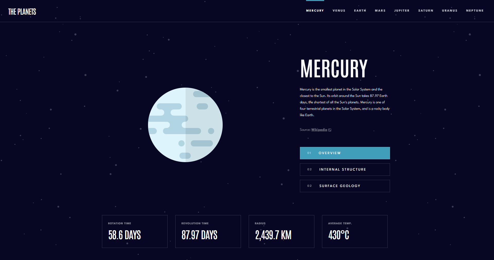

# Frontend Mentor - Planets fact site solution

This is a solution to the [Planets fact site challenge on Frontend Mentor](https://www.frontendmentor.io/challenges/planets-fact-site-gazqN8w_f). Frontend Mentor challenges help you improve your coding skills by building realistic projects. 

## Table of contents

- [Overview](#overview)
  - [The challenge](#the-challenge)
  - [Screenshot](#screenshot)
  - [Links](#links)
- [My process](#my-process)
  - [Built with](#built-with)
  - [What I learned](#what-i-learned)
  - [Continued development](#continued-development)
- [Author](#author)
- [Acknowledgments](#acknowledgments)

## Overview

### The challenge

Users should be able to:

- View the optimal layout for the app depending on their device's screen size
- See hover states for all interactive elements on the page
- View each planet page and toggle between "Overview", "Internal Structure", and "Surface Geology"

### Screenshot




### Links

- Solution URL: [https://github.com/des0lt/dine-restaurant](https://github.com/des0lt/dine-restaurant)
- Live Site URL: [https://des0lt.github.io/dine-restaurant/](https://des0lt.github.io/dine-restaurant/)

## My process

### Built with

- Semantic HTML5 markup
- CSS custom properties
- Flexbox

### What I learned

**В цьому проєкті я:**

Використовував meta-теги
```html
  <meta name="title" content="Planets fact">
  <meta name="description" content="Explore the planets of the Solar System and learn about their orbits, structure, and unique features.">
  <meta name="keywords" content="planets, space, astronomy, Mercury, Venus, Earth, Mars, Jupiter, Saturn, Uranus, Neptune">
  <meta name="robots" content="index, follow">
  <meta http-equiv="Content-Type" content="text/html; charset=utf-8">
  <meta name="language" content="English">
  <meta name="author" content="Roman">        
  <meta name="viewport" content="width=device-width, initial-scale=1.0">
```

Використовував CSS custom properties (variables), які надалі змінював в JS
```css
:root {
    --white: #fff;
    --dark-blue: #070724;
    --dark-grey: #38384F;
    --grey: #838391;
    --light-blue: #419EBB;
    --yellow: #EDA249;
    --purple: #6f2ed6;
    --orange: #D14C32;
    --red: #D83A34;
    --brown: #CD5120;
    --green: #1ec2a4;
    --blue: #2d68f0;

    --main-color: var(--light-blue);
    --main-size: 43.5%;
}
```
```js
mainColors = ['var(--light-blue)', 'var(--yellow)', 'var(--purple)', 'var(--brown)', 'var(--red)', 'var(--orange)', 'var(--green)', 'var(--blue'];
planetsSize = ['43.5%', '60%', '67.5%', '50.5%', '87.3%', '100%', '68.8%', '67.5%'];

    navBar.forEach((element, i) => {
      element.addEventListener('click', (e) => {
          e.preventDefault();
          document.documentElement.style.setProperty('--main-color', mainColors[i]);
          document.documentElement.style.setProperty('--main-size', planetsSize[i]);
          ...
      });
    });
```
Оновив свої знання по роботі з json-даними

```js
fetch('./data.json')
    .then(res => res.json())
    .then(data => {

      ...

    }).catch(err => document.querySelector('main').innerHTML = `
        <div id="error-text">
            <h1 class="antonio-medium-h1">Сталася помилка, спробуйте оновити сторінку<h1><br>
            <span class="league-spartan-h3">${err}<span>
        </div>
    `
    );
```

Оновив свої знання класів в JavaScript

```js
class Planet {
            constructor(data) {
                this.name = data.name;
                this.overview = data.overview;
                this.structure = data.structure;
                ...
            }

            switchImg(i) {
                const pictures = document.querySelectorAll('.picture div');
                pictures.forEach(picture => {
                    picture.classList.remove('active');
                    if (i === 2) {
                        pictures[0].classList.add('active');
                        pictures[2].classList.add('active');
                    } else {
                        pictures[i].classList.add('active');
                    }
                })
            }

            ...
}
```

Рендерив частину сторінки за допомогою метода render() та змінював певні елементи при натисканні кнопок
```js
  render() {
    const parent = document.querySelector('main');
    parent.innerHTML = `
    <div class="planet-illustration">
        <div class="picture"></div>
        <div class="descr">
            <div class="text-wrapp">
                <h1 class="antonio-medium-h1" id="name"></h1>
                <p class="descr-text league-spartan-body active"></p>
                <p class="descr-text league-spartan-body"></p>
                <p class="descr-text league-spartan-body"></p>
                <div class="source league-spartan-body"></div>
            </div>
            <div class="buttons-wrap">
                <button class="league-spartan-h3 active">
                    <span>01</span>
                    <h3>overview</h3>
                </button>

            ...
    `
  }

   changeImg() {
      const pictures = document.querySelector('.picture');
      pictures.innerHTML = `
          <div class="planet active" style="background-image: url('${this.images.planet}');"></div>
          <div class="planet-internal" style="background-image: url('${this.images.internal}');"></div>
          <div class="geology" style="background-image: url('${this.images.geology}');"></div>
      `
    }

    changeName() {
        const nameId = document.querySelector('#name');
        nameId.innerHTML = this.name;
    }

    ...
```
### Continued development

В цьому проєкті я зіткнувався із проблемою розміру ```background-image``` і поспілкувавшись зі своїм ментором я обрав варіант записати всі розміри планет у масив та змінювати їх за допомогою ```navbar```

```js
planetsSize = ['43.5%', '60%', '67.5%', '50.5%', '87.3%', '100%', '68.8%', '67.5%'];

document.documentElement.style.setProperty('--main-size', planetsSize[i]);
```

В майбутньому я б ще хотів брати завдання з готови даними, бо вважаю це корисним досвідом для праці в майбутньому.

## Author

- GitHub - [des0lt](https://github.com/des0lt)

## Acknowledgments

Я б хотів віддячити свого ментона Івана за надання та допомогу з цим проєктом. На мої запитання він давав мені пояснення та корисні ресурси, щоб я ознайомився з вирішенням цих проблем.
